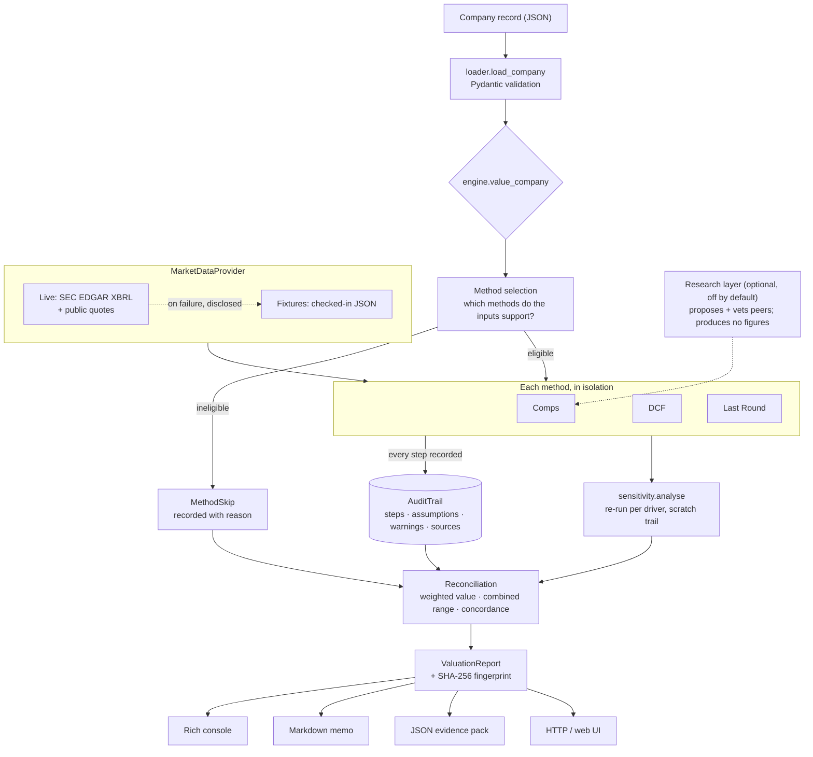

# Architecture and workflow

Companion to the [README](../README.md): how the pieces fit together, what each method does, and a
worked example end to end.

## Data flow



Recoverable failures (`DataUnavailableError`, `InsufficientEvidenceError`, `MissingInputError`)
divert one method into `MethodSkip` and the run continues. Fatal failures (`AssumptionError`) stop
it: a conclusion drawn partly from a model the engine knows to be invalid is worse than no answer.

## Module map

| Module | Responsibility |
|---|---|
| `domain/audit.py` | `AuditTrail`, `Step`, `Assumption`, `SourceRef`, fingerprinting — the spine |
| `domain/models.py` | Company, peers, filings, funnel, ranges, results, report |
| `domain/errors.py` | Recoverable vs fatal failure taxonomy |
| `data/base.py` | `MarketDataProvider` protocol + `PeerScreenResult` — the only seam to the outside |
| `data/sec.py` | EDGAR XBRL: tag resolution, LTM assembly, freshness, filing citations |
| `data/quotes.py` | Closing prices and index history |
| `data/universe.py` | Per-sector candidate tickers — the deterministic baseline |
| `data/live_provider.py` | Builds each peer's EV from its components, or explains why it can't |
| `data/mock_provider.py` | Fixture-backed provider, with a simulated-outage switch |
| `data/resilient.py` | Live-first with a **disclosed** fixture fallback |
| `research/` | Optional model-driven peer proposal and review, fully recorded |
| `context.py` | `ValuationContext.assume()` — the single assumption accessor |
| `methods/` | Plugin contract, `DriverSpec`, the three methodologies, the registry |
| `sensitivity.py` | Method-agnostic one-at-a-time sweep |
| `engine.py` | Selection, isolation, reconciliation, concordance, provenance |
| `reporting/` | Console, Markdown memo, evidence pack — all read, none compute |
| `cli.py`, `api/` | Two front ends over one engine |

## Where peer fundamentals come from

Most tooling reads a vendor's pre-computed `enterpriseValue` field. That is convenient and
unauditable: asked "where did $39.5B come from", the honest answer is "the vendor said so".

The live provider instead assembles it:

```
market cap = shares outstanding (SEC XBRL, dei) × close (public quote)
EV         = market cap + debt (SEC XBRL) − cash (SEC XBRL)
EV/Revenue = EV / LTM revenue (SEC XBRL, four trailing quarters)
```

Two XBRL realities shape that code, and both were found by reading real filings:

* **Filers migrate between tags.** ServiceNow's last `LongTermDebtNoncurrent` fact is from 2021;
  it now files `LongTermDebt`. Taking the first tag with data would value a 2026 company on a 2021
  balance sheet, so candidate tags are gathered together, anything older than 15 months is
  discarded, and the freshest fact wins.
* **Periods overlap.** A 10-K's 12-month figure covers the same span as its quarters, so summing
  naively double-counts. LTM revenue is assembled from four non-overlapping quarters, falling back
  to the latest annual figure — and says which basis it used.

Debt and cash decomposition genuinely varies by filer, so rather than pretend otherwise the
provider **records the tags it used** (`us-gaap:LongTermDebt @2026-06-30 + us-gaap:ShortTermBorrowings
@2026-06-30`) into the audit trail. An imprecision a reviewer can see and judge beats one hidden
behind a single number.

## The peer funnel

Comps reports the narrowing from universe to valued peer set, because how much judgement stood
between the two is itself evidence:

| Stage | Meaning |
|---|---|
| Considered | The sector universe, plus any research-layer proposals |
| Dropped — data | No usable filings, no shares outstanding, no price, or non-positive EV |
| Dropped — not comparable | Outside the size band, or rejected by the research layer |
| Dropped — outlier | Outside the Tukey fence (`Q1 − 1.5·IQR`, `Q3 + 1.5·IQR`) |
| Valued against | Minimum of three enforced — a "median" of two is not a market observation |

Every rejection carries a specific reason and appears in the memo and the UI.

## The methods

**Comps.** Screen, build each peer's EV, trim outliers by fence (mechanically, so exclusions are
reproducible), take the **median** (multiples are right-skewed; one hyper-growth peer would drag a
mean), apply an illiquidity discount, apply to subject revenue, bridge EV → equity. The range comes
from the peer **interquartile** multiples, so it reports observed disagreement among comparables
rather than an assumed tolerance.

**DCF.** Unlevered FCF (`EBIT·(1−t) + D&A − capex − ΔNWC`) discounted at WACC, end-of-period, plus a
Gordon terminal value. WACC at or below terminal growth is fatal. Terminal-value concentration is
measured, and past 75% of EV the run raises an exception: the "discounted cash flow" is really a
perpetuity assumption wearing a forecast.

**Last Round.** The only observed transaction price in the company's own securities — an
observation where the other two are inferences. Its weakness is staleness, and the index adjustment
is the correction. The index is sector-matched (marking 2022 software to the broad composite badly
understates the drawdown) and recorded as an overridable assumption. Rounds older than two years
raise an exception. The range brackets the two defensible extremes: unadjusted (β = 0) and fully
marked (β = 1).

## The research layer

Off by default. A sector tag is blunt — "SaaS" contains both a 90%-margin infrastructure business
and a services-heavy implementation shop — and judging which businesses genuinely resemble each
other is what a language model is good at. Two rules make that admissible:

* **The model judges; Python calculates.** It may propose tickers and argue comparability. It never
  produces a number. Every figure is computed from filings.
* **Every call is an audit step** carrying the model id, effort, token usage, and the SHA-256 of the
  exact prompt — so a reviewer can see that a machine made a judgement, which machine, and on what
  input.

Proposals are *added* to the standing universe, never substituted for it; the model sees each peer's
**SEC registrant name**, so a hallucinated ticker resolves to its true owner and gets rejected on
sight; a failed call degrades to the deterministic universe; and a review that would leave fewer than
three peers is recorded but not applied.

## Reconciliation

Weights (0.35 / 0.30 / 0.35) express relative confidence and are renormalised over whichever methods
ran, so a skipped method redistributes its weight rather than dragging the answer toward zero.
Dispersion is the coefficient of variation across method conclusions:

| CV | Classification | Meaning |
|---|---|---|
| ≤ 10% | tight | Independent methods converging — real corroboration |
| ≤ 25% | moderate | Normal for a private company; quote the range |
| > 25% | wide | **Exception raised.** Reconcile before booking — a weighted average of conflicting evidence is not evidence |
| — | single-method | Uncorroborated; rests on one method's assumptions |

## Worked example

```bash
vc-audit value examples/basis_ai.json --as-of 2026-08-21 --data live --detail
```

Basis AI has complete data, so all three methods run against live SaaS comparables drawn from
current 10-K/10-Q filings. The run raises six exceptions — wide cross-method dispersion, a terminal
value at 83% of enterprise value, a round that closed 4.4 years ago, and a peer excluded at 28x
revenue among them.

That is the intended output. The tool's job is not to make three methods agree; it is to show that
they don't, and why.

The other examples exercise the other paths: `inflo.json` (no projections → DCF skipped, the two
remaining methods converge at CV 9.0%) and `northwind_labs.json` (round data only → single-method,
flagged uncorroborated).

## Reproducibility

`run_id` is a UUIDv5 over the canonical inputs; the fingerprint is a SHA-256 over every trail. Same
inputs and same code produce the same memo byte for byte, so a reviewer can diff quarters and see
only real changes. Memos carry no generation timestamp — it would make two identical valuations diff
as different.

With `--data fixtures` a run is fully offline and deterministic. With live data and a **past**
`--as-of`, it is equally reproducible: filings and closing prices for a historical date do not
change, and no source is permitted to return data dated after the valuation date. Only `--as-of`
today drifts, and only because the market is still open.

```bash
vc-audit value examples/inflo.json --as-of 2026-08-21 --data fixtures --out out
vc-audit runs
vc-audit explain <run-id> --markdown
```
