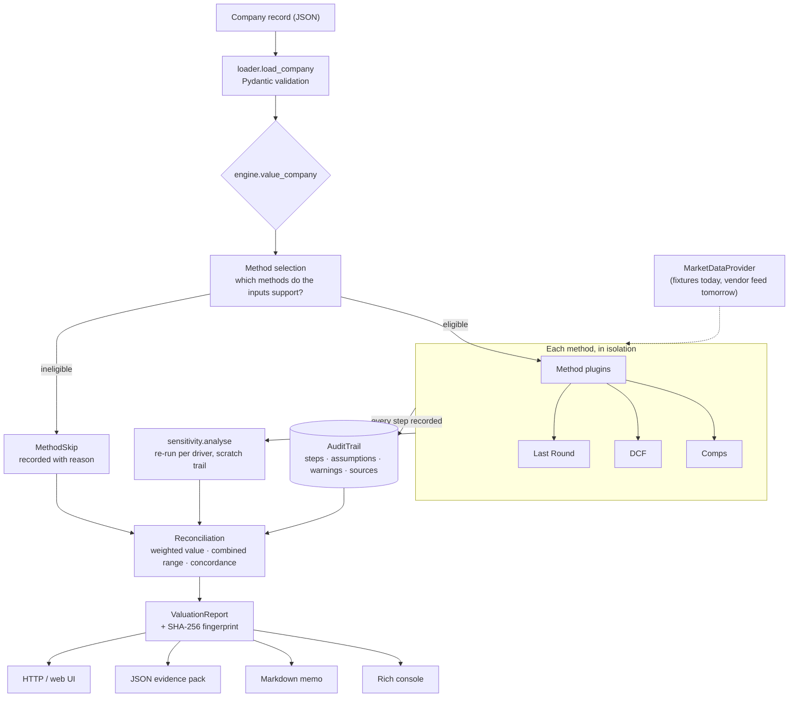

# Architecture and workflow

Companion to the [README](../README.md). This document covers how the pieces fit together, what
each valuation method actually does, and a worked example end to end.

## Data flow



Recoverable failures (`DataUnavailableError`, `InsufficientEvidenceError`, `MissingInputError`)
divert a single method into `MethodSkip` and the run continues. Fatal failures (`AssumptionError`)
stop the run: a blended conclusion drawn partly from a model the engine knows to be invalid would
be worse than no answer.

## Module map

| Module | Responsibility |
|---|---|
| `domain/audit.py` | `AuditTrail`, `Step`, `Assumption`, `SourceRef`, fingerprinting — the spine |
| `domain/models.py` | Company, peers, ranges, results, report |
| `domain/errors.py` | Recoverable vs fatal failure taxonomy |
| `data/base.py` | `MarketDataProvider` protocol — the only seam to the outside world |
| `data/mock_provider.py` | Fixture-backed implementation, with a simulated-outage switch |
| `context.py` | `ValuationContext.assume()` — the single assumption accessor |
| `methods/base.py` | Plugin contract, `DriverSpec`, shared equity bridge |
| `methods/{comps,dcf,last_round}.py` | The three methodologies |
| `methods/registry.py` | The one place that knows which methods exist |
| `sensitivity.py` | Method-agnostic one-at-a-time sweep |
| `engine.py` | Selection, isolation, reconciliation, concordance |
| `reporting/` | Console, Markdown memo, evidence pack — all read, none compute |
| `cli.py`, `api/` | Two front ends over one engine |

## The methods in detail

### Comparable Company Analysis

1. Screen the peer universe by sector and a (deliberately wide) revenue band.
2. Build each peer's EV — `market cap + debt − cash` — and divide by LTM revenue. Computed here,
   not taken from an opaque vendor field, so the bridge is auditable.
3. Trim outliers with a Tukey fence (`Q1 − 1.5·IQR`, `Q3 + 1.5·IQR`). Mechanical, so exclusions are
   reproducible; every dropped peer is named in a warning.
4. Take the **median** — multiples are right-skewed and one hyper-growth peer would drag a mean.
5. Apply an illiquidity discount (default 20%, overridable).
6. Apply to subject revenue, then bridge EV → equity.
7. Range comes from the peer **interquartile** multiples, so it reports observed disagreement among
   comparables rather than an assumed tolerance.

Declines to conclude below three surviving peers: a "median" of two is not a market observation.

### Discounted Cash Flow

Unlevered FCF (`EBIT·(1−t) + D&A − capex − ΔNWC`) discounted at WACC, end-of-period convention,
plus a Gordon terminal value. Two guardrails:

- **WACC must exceed terminal growth** — otherwise Gordon has no finite solution. Fatal.
- **Terminal value concentration is measured.** Past 75% of EV, the "discounted cash flow" is really
  a perpetuity assumption wearing a forecast, and that is raised as an exception.

Range comes from re-running at WACC ±200bps.

### Last Round (market-adjusted)

The last priced round is the only observable transaction in the company's own securities — an
observation, where the other two are inferences. Its weakness is staleness, and the index adjustment
is the correction.

The index is chosen by sector (SaaS marks against a cloud index, not the broad Nasdaq — marking 2022
software to the composite badly understates the drawdown) and recorded as an overridable assumption.
Rounds older than two years raise an exception. The range brackets the two defensible extremes:
the unadjusted round value (β = 0, "the round still holds") and the fully marked value (β = 1).

## Reconciliation

Weights (0.35 / 0.30 / 0.35) express relative confidence and are renormalised over whichever methods
ran, so a skipped method redistributes its weight instead of dragging the answer toward zero.

Dispersion is measured as the coefficient of variation across method conclusions:

| CV | Classification | Meaning |
|---|---|---|
| ≤ 10% | tight | Independent methods converging — real corroboration |
| ≤ 25% | moderate | Normal for a private company; quote the range |
| > 25% | wide | **Exception raised.** Reconcile before booking — a weighted average of conflicting evidence is not evidence |
| — | single-method | Uncorroborated; the conclusion rests on one method's assumptions |

## Worked example

```bash
vc-audit value examples/basis_ai.json --as-of 2026-08-22 --detail
```

Basis AI has complete data, so all three methods run:

| Method | Conclusion | Most sensitive to |
|---|---:|---|
| Comps | $79,777,778 | Peer size band |
| DCF | $56,536,920 | Discount rate (±2% moves it 35%) |
| Last Round | $106,139,288 | Index beta |

Weighted conclusion **$82,032,049**, range $48.4M – $120.0M, and the run raises six exceptions —
including wide cross-method dispersion (CV 30.7%), a terminal value at 83% of enterprise value, a
round that closed 4.4 years ago, and one peer excluded at 28.33x revenue.

That is the intended output. The tool's job is not to make three methods agree; it is to show that
they don't, and why.

The other two examples exercise the other paths: `inflo.json` (no projections → DCF skipped, the two
remaining methods converge, CV 9.0%) and `northwind_labs.json` (round data only → single-method,
flagged as uncorroborated).

## Reproducibility

`run_id` is a UUIDv5 over the canonical inputs; the fingerprint is a SHA-256 over every trail in the
report. Same inputs and same code produce the same memo byte for byte, so a reviewer can diff
quarters and see only real changes. Memos deliberately carry no generation timestamp — it would make
two identical valuations diff as different.

```bash
vc-audit value examples/inflo.json --as-of 2026-08-22 --out out   # run once
vc-audit runs                                                     # find the run id
vc-audit explain <run-id> --markdown                              # reopen without recomputing
```
